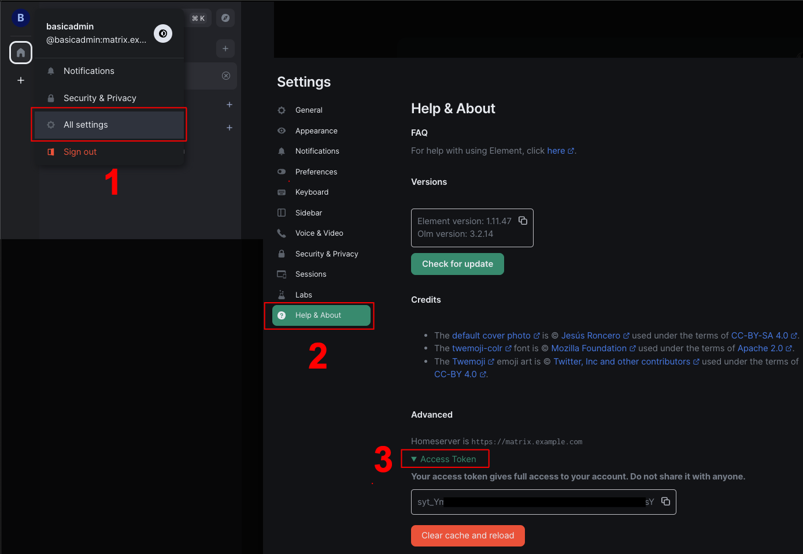

# Matrix Helm Chart

  

A helm chart for Matrix homeserver, element web-client, Jitsi conference and other components. This repo uses the [helm chart](https://github.com/typokign/matrix-chart) developed by @typokign as a basis.
## Source Code

* <https://github.com/dacruz21/matrix-chart>
* <https://github.com/Alpacked/matrix-helm>

## Features

- Latest version of Synapse with plugin installation support.
- (Optional) Element (Riot) Web ([vectorim/element-web](https://github.com/element-hq/element-web))
- (Optional) Synapse Admin Web ([awesometechnologies/synapse-admin](https://github.com/Awesome-Technologies/synapse-admin))
- (Optional) User Verification Service ([matrixdotorg/matrix-user-verification-service](https://github.com/matrix-org/matrix-user-verification-service))
- (Optional) Exim relay or external mail server for email notifications ([devture/exim-relay](https://github.com/devture/exim-relay))
- (Optional) Coturn TURN server for VoIP calls ([coturn/coturn](https://github.com/coturn/coturn))
- (Optional) Jitsi for video conferences with Matrix authorization ([jitsi-contrib/jitsi-helm](https://github.com/jitsi-contrib/jitsi-helm))
- (Optional) PostgreSQL database cluster ([bitnami/postgresql](https://artifacthub.io/packages/helm/bitnami/postgresql))
- (Optional) Redis for multi-worker deployment ([bitnami/redis](https://artifacthub.io/packages/helm/bitnami/redis))
- (Optional) IRC bridge ([matrixdotorg/matrix-appservice-irc](https://github.com/matrix-org/matrix-appservice-irc))
- (Optional) WhatsApp bridge ([tulir/mautrix-whatsapp](https://github.com/mautrix/whatsapp))
- (Optional) Discord bridge ([halfshot/matrix-appservice-discord](https://github.com/matrix-org/matrix-appservice-discord))
- Fully configurable via values.yaml
- NGINX Ingress definition for federated Synapse, Admin, Element (Riot) and Jitsi.

## Configuration

The basic configuration of chart is done in default [values.yaml](values.yaml), main configuration by user is:
1. Enable optional services that you require.
2. Provide valid DNS names for applications.
3. Set persistent storages for your database and other apps, that require it.
4. Configure ingress for service endpoints (or use predefined for NGINX Ingress).
5. Deploy to your k8s cluster.

## Caveats

Jitsi application is configured to use Matrix authorization by default, but right now it can't be configured automatically via Helm chart installation.

After deployment of Synapse required to create admin user and get access token, that can be provided via `.Values.matrix.uvs.accessToken`.

More info about providing admin rights and API can be found [here](https://github.com/matrix-org/synapse/blob/develop/docs/usage/administration/admin_api/README.md).

In future this can be changed (https://matrix.org/blog/2023/09/better-auth) and currently Matrix team testing side-car [matrix-authentication-service](https://matrix-org.github.io/matrix-authentication-service/).

Despite Redis included in this chart, the multi-worker Synapse is not tested and can be not fully configured in [homeserver.yaml](templates/synapse/_homeserver.yaml).

External Secret manifest can be used for more secure value storage, but it doesn't contain all chart values right not.

## Requirements

| Repository | Name | Version |
|------------|------|---------|
| https://charts.bitnami.com/bitnami | postgresql | 13.2.0 |
| https://charts.bitnami.com/bitnami | redis | 18.2.0 |
| https://jitsi-contrib.github.io/jitsi-helm | jitsi(jitsi-meet) | 1.3.8 |

## Values

<h3>Bridges</h3>
<table>
	<thead>
		<th>Key</th>
		<th>Type</th>
		<th>Default</th>
		<th>Description</th>
	</thead>
	<tbody>
		<tr>
			<td>bridges.affinity</td>
			<td>bool</td>
			<td><pre lang="json">
false
</pre>
</td>
			<td>Recommended to leave this disabled to allow bridges to be scheduled on separate nodes.</td>
		</tr>
		<tr>
			<td>bridges.volume.accessMode</td>
			<td>string</td>
			<td><pre lang="json">
"ReadWriteMany"
</pre>
</td>
			<td>Access mode of the shared volume.</td>
		</tr>
		<tr>
			<td>bridges.volume.capacity</td>
			<td>string</td>
			<td><pre lang="json">
"1Mi"
</pre>
</td>
			<td>Capacity of the shared volume for storing bridge/appservice registration files</td>
		</tr>
		<tr>
			<td>bridges.volume.storageClass</td>
			<td>string</td>
			<td><pre lang="json">
""
</pre>
</td>
			<td>Storage class (optional)</td>
		</tr>
	</tbody>
</table>
<h3>Discord bridge</h3>
<table>
	<thead>
		<th>Key</th>
		<th>Type</th>
		<th>Default</th>
		<th>Description</th>
	</thead>
	<tbody>
		<tr>
			<td>bridges.discord.auth</td>
			<td>object</td>
			<td><pre lang="json">
{
  "botToken": "",
  "clientId": ""
}
</pre>
</td>
			<td>Discord bot authentication</td>
		</tr>
		<tr>
			<td>bridges.discord.channelName</td>
			<td>string</td>
			<td><pre lang="json">
"[Discord] :guild :name"
</pre>
</td>
			<td>The name of bridged rooms</td>
		</tr>
		<tr>
			<td>bridges.discord.data</td>
			<td>object</td>
			<td><pre lang="json">
{
  "capacity": "512Mi",
  "storageClass": ""
}
</pre>
</td>
			<td>PVC to allocate for the SQLite database</td>
		</tr>
		<tr>
			<td>bridges.discord.defaultVisibility</td>
			<td>string</td>
			<td><pre lang="json">
"public"
</pre>
</td>
			<td>Default visibility of bridged rooms (public/private)</td>
		</tr>
		<tr>
			<td>bridges.discord.enabled</td>
			<td>bool</td>
			<td><pre lang="json">
false
</pre>
</td>
			<td>Set to true to enable the Discord bridge</td>
		</tr>
		<tr>
			<td>bridges.discord.image</td>
			<td>object</td>
			<td><pre lang="json">
{
  "pullPolicy": "Always",
  "repository": "halfshot/matrix-appservice-discord",
  "tag": "v1.0.0"
}
</pre>
</td>
			<td>Image of bridge container</td>
		</tr>
		<tr>
			<td>bridges.discord.joinLeaveEvents</td>
			<td>bool</td>
			<td><pre lang="json">
true
</pre>
</td>
			<td>Set to false to disable Discord notifications when a user joins/leaves the Matrix channel</td>
		</tr>
		<tr>
			<td>bridges.discord.presence</td>
			<td>bool</td>
			<td><pre lang="json">
true
</pre>
</td>
			<td>Set to false to disable online/offline presence for Discord users</td>
		</tr>
		<tr>
			<td>bridges.discord.readReceipt</td>
			<td>bool</td>
			<td><pre lang="json">
true
</pre>
</td>
			<td>Set to false to disable the Discord bot read receipt, which advances whenever the bot bridges a message</td>
		</tr>
		<tr>
			<td>bridges.discord.replicaCount</td>
			<td>int</td>
			<td><pre lang="json">
1
</pre>
</td>
			<td>Replica count</td>
		</tr>
		<tr>
			<td>bridges.discord.resources</td>
			<td>object</td>
			<td><pre lang="json">
{}
</pre>
</td>
			<td>Pod resources</td>
		</tr>
		<tr>
			<td>bridges.discord.selfService</td>
			<td>bool</td>
			<td><pre lang="json">
false
</pre>
</td>
			<td>Set to true to allow users to bridge rooms themselves using !discord commands</td>
		</tr>
		<tr>
			<td>bridges.discord.service</td>
			<td>object</td>
			<td><pre lang="json">
{
  "port": 9005,
  "type": "ClusterIP"
}
</pre>
</td>
			<td>Service configuration</td>
		</tr>
		<tr>
			<td>bridges.discord.typingNotifications</td>
			<td>bool</td>
			<td><pre lang="json">
true
</pre>
</td>
			<td>Set to false to disable typing notifications (only for Discord to Matrix)</td>
		</tr>
		<tr>
			<td>bridges.discord.users.nickname</td>
			<td>string</td>
			<td><pre lang="json">
":nick"
</pre>
</td>
			<td>Nickname of bridged Discord users</td>
		</tr>
		<tr>
			<td>bridges.discord.users.username</td>
			<td>string</td>
			<td><pre lang="json">
":username#:tag"
</pre>
</td>
			<td>Username of bridged Discord users</td>
		</tr>
	</tbody>
</table>
<h3>IRC bridge</h3>
<table>
	<thead>
		<th>Key</th>
		<th>Type</th>
		<th>Default</th>
		<th>Description</th>
	</thead>
	<tbody>
		<tr>
			<td>bridges.irc.data</td>
			<td>object</td>
			<td><pre lang="json">
{
  "capacity": "1Mi",
  "storageClass": ""
}
</pre>
</td>
			<td>PVC to allocate for the IRC bridge container</td>
		</tr>
		<tr>
			<td>bridges.irc.database</td>
			<td>string</td>
			<td><pre lang="json">
"matrix_irc"
</pre>
</td>
			<td>Name of Postgres database to store IRC bridge data in</td>
		</tr>
		<tr>
			<td>bridges.irc.databaseSslVerify</td>
			<td>bool</td>
			<td><pre lang="json">
true
</pre>
</td>
			<td>Verify SSL database connection</td>
		</tr>
		<tr>
			<td>bridges.irc.enabled</td>
			<td>bool</td>
			<td><pre lang="json">
false
</pre>
</td>
			<td>Set to true to enable the IRC bridge</td>
		</tr>
		<tr>
			<td>bridges.irc.image</td>
			<td>object</td>
			<td><pre lang="json">
{
  "pullPolicy": "IfNotPresent",
  "repository": "matrixdotorg/matrix-appservice-irc",
  "tag": "release-1.0.1"
}
</pre>
</td>
			<td>Image of bridge container</td>
		</tr>
		<tr>
			<td>bridges.irc.presence</td>
			<td>bool</td>
			<td><pre lang="json">
false
</pre>
</td>
			<td>Whether to enable presence (online/offline indicators).</td>
		</tr>
		<tr>
			<td>bridges.irc.replicaCount</td>
			<td>int</td>
			<td><pre lang="json">
1
</pre>
</td>
			<td>Replica count</td>
		</tr>
		<tr>
			<td>bridges.irc.resources</td>
			<td>object</td>
			<td><pre lang="json">
{}
</pre>
</td>
			<td>Pod resources</td>
		</tr>
		<tr>
			<td>bridges.irc.servers</td>
			<td>object</td>
			<td><pre lang="json">
{
  "chat.freenode.net": {
    "name": "Freenode",
    "port": 6697,
    "ssl": true
  }
}
</pre>
</td>
			<td>Object of IRC servers to connect to, see https://github.com/matrix-org/matrix-appservice-irc/blob/master/config.sample.yaml for config options</td>
		</tr>
		<tr>
			<td>bridges.irc.service</td>
			<td>object</td>
			<td><pre lang="json">
{
  "port": 9006,
  "type": "ClusterIP"
}
</pre>
</td>
			<td>Service configuration</td>
		</tr>
	</tbody>
</table>
<h3>WhatsApp bridge</h3>
<table>
	<thead>
		<th>Key</th>
		<th>Type</th>
		<th>Default</th>
		<th>Description</th>
	</thead>
	<tbody>
		<tr>
			<td>bridges.whatsapp.bot</td>
			<td>object</td>
			<td><pre lang="json">
{
  "avatar": "mxc://maunium.net/NeXNQarUbrlYBiPCpprYsRqr",
  "displayName": "WhatsApp bridge bot",
  "username": "whatsappbot"
}
</pre>
</td>
			<td>Username and display name of the WhatsApp bridge bot</td>
		</tr>
		<tr>
			<td>bridges.whatsapp.callNotices</td>
			<td>bool</td>
			<td><pre lang="json">
true
</pre>
</td>
			<td>Send notifications for incoming calls</td>
		</tr>
		<tr>
			<td>bridges.whatsapp.communityName</td>
			<td>string</td>
			<td><pre lang="json">
"whatsapp_{{.Localpart}}={{.Server}}"
</pre>
</td>
			<td>Display name for communities.</td>
		</tr>
		<tr>
			<td>bridges.whatsapp.connection.maxAttempts</td>
			<td>int</td>
			<td><pre lang="json">
3
</pre>
</td>
			<td>Maximum number of connection attempts before failing</td>
		</tr>
		<tr>
			<td>bridges.whatsapp.connection.qrRegenCount</td>
			<td>int</td>
			<td><pre lang="json">
2
</pre>
</td>
			<td>Number of QR codes to store, essentially multiplying the connection timeout</td>
		</tr>
		<tr>
			<td>bridges.whatsapp.connection.reportRetry</td>
			<td>bool</td>
			<td><pre lang="json">
true
</pre>
</td>
			<td>Whether or not to notify the user when attempting to reconnect. Set to false to only report when maxAttempts has been reached</td>
		</tr>
		<tr>
			<td>bridges.whatsapp.connection.retryDelay</td>
			<td>int</td>
			<td><pre lang="json">
-1
</pre>
</td>
			<td>Retry delay</td>
		</tr>
		<tr>
			<td>bridges.whatsapp.connection.timeout</td>
			<td>int</td>
			<td><pre lang="json">
20
</pre>
</td>
			<td>WhatsApp server connection timeout (seconds)</td>
		</tr>
		<tr>
			<td>bridges.whatsapp.data</td>
			<td>object</td>
			<td><pre lang="json">
{
  "capacity": "512Mi",
  "storageClass": ""
}
</pre>
</td>
			<td>PVC to allocate for the SQLite database</td>
		</tr>
		<tr>
			<td>bridges.whatsapp.enabled</td>
			<td>bool</td>
			<td><pre lang="json">
false
</pre>
</td>
			<td>Set to true to enable the WhatsApp bridge</td>
		</tr>
		<tr>
			<td>bridges.whatsapp.image</td>
			<td>object</td>
			<td><pre lang="json">
{
  "pullPolicy": "Always",
  "repository": "dock.mau.dev/tulir/mautrix-whatsapp",
  "tag": "v0.10.3"
}
</pre>
</td>
			<td>Image of bridge container</td>
		</tr>
		<tr>
			<td>bridges.whatsapp.permissions</td>
			<td>object</td>
			<td><pre lang="json">
{
  "*": "relaybot"
}
</pre>
</td>
			<td>Permissions for using the bridge.</td>
		</tr>
		<tr>
			<td>bridges.whatsapp.relaybot.enabled</td>
			<td>bool</td>
			<td><pre lang="json">
false
</pre>
</td>
			<td>Set to true to enable the relaybot and management room</td>
		</tr>
		<tr>
			<td>bridges.whatsapp.relaybot.invites</td>
			<td>list</td>
			<td><pre lang="json">
[]
</pre>
</td>
			<td>Users to invite to the management room automatically</td>
		</tr>
		<tr>
			<td>bridges.whatsapp.relaybot.management</td>
			<td>string</td>
			<td><pre lang="json">
"!foo:example.com"
</pre>
</td>
			<td>Management room for the relay bot where status notifications are posted</td>
		</tr>
		<tr>
			<td>bridges.whatsapp.replicaCount</td>
			<td>int</td>
			<td><pre lang="json">
1
</pre>
</td>
			<td>Replica count</td>
		</tr>
		<tr>
			<td>bridges.whatsapp.resources</td>
			<td>object</td>
			<td><pre lang="json">
{}
</pre>
</td>
			<td>Pod resources</td>
		</tr>
		<tr>
			<td>bridges.whatsapp.service</td>
			<td>object</td>
			<td><pre lang="json">
{
  "port": 29318,
  "type": "ClusterIP"
}
</pre>
</td>
			<td>Service configuration</td>
		</tr>
		<tr>
			<td>bridges.whatsapp.users.displayName</td>
			<td>string</td>
			<td><pre lang="json">
"{{if .Notify}}{{.Notify}}{{else}}{{.Jid}}{{end}} (WA)"
</pre>
</td>
			<td>Display name for WhatsApp users</td>
		</tr>
		<tr>
			<td>bridges.whatsapp.users.username</td>
			<td>string</td>
			<td><pre lang="json">
"whatsapp_{{.}}"
</pre>
</td>
			<td>Username for WhatsApp users</td>
		</tr>
	</tbody>
</table>
<h3>Coturn</h3>
<table>
	<thead>
		<th>Key</th>
		<th>Type</th>
		<th>Default</th>
		<th>Description</th>
	</thead>
	<tbody>
		<tr>
			<td>coturn.allowGuests</td>
			<td>bool</td>
			<td><pre lang="json">
true
</pre>
</td>
			<td>Whether to allow guests to use the TURN server</td>
		</tr>
		<tr>
			<td>coturn.enabled</td>
			<td>bool</td>
			<td><pre lang="json">
false
</pre>
</td>
			<td>Set to true to enable the included deployment of Coturn</td>
		</tr>
		<tr>
			<td>coturn.image</td>
			<td>object</td>
			<td><pre lang="json">
{
  "pullPolicy": "IfNotPresent",
  "repository": "coturn/coturn",
  "tag": "4.6.2"
}
</pre>
</td>
			<td>Image configuration of pod</td>
		</tr>
		<tr>
			<td>coturn.kind</td>
			<td>string</td>
			<td><pre lang="json">
"DaemonSet"
</pre>
</td>
			<td>How to deploy Coturn</td>
		</tr>
		<tr>
			<td>coturn.labels</td>
			<td>object</td>
			<td><pre lang="json">
{
  "component": "coturn"
}
</pre>
</td>
			<td>Coturn specific labels</td>
		</tr>
		<tr>
			<td>coturn.ports</td>
			<td>object</td>
			<td><pre lang="json">
{
  "from": 49152,
  "to": 49172
}
</pre>
</td>
			<td>UDP port range for TURN connections</td>
		</tr>
		<tr>
			<td>coturn.replicaCount</td>
			<td>int</td>
			<td><pre lang="json">
1
</pre>
</td>
			<td>Replica configuration</td>
		</tr>
		<tr>
			<td>coturn.resources</td>
			<td>object</td>
			<td><pre lang="json">
{}
</pre>
</td>
			<td>Resource configuration</td>
		</tr>
		<tr>
			<td>coturn.service.type</td>
			<td>string</td>
			<td><pre lang="json">
"ClusterIP"
</pre>
</td>
			<td>The type of service to deploy for routing Coturn traffic</td>
		</tr>
		<tr>
			<td>coturn.sharedSecret</td>
			<td>string</td>
			<td><pre lang="json">
""
</pre>
</td>
			<td>Shared secret for communication between Synapse and Coturn.</td>
		</tr>
		<tr>
			<td>coturn.uris</td>
			<td>list</td>
			<td><pre lang="json">
[
  "turn:marix.example.com?transport=udp"
]
</pre>
</td>
			<td>URIs of the Coturn servers</td>
		</tr>
	</tbody>
</table>
<h3>Globals</h3>
<table>
	<thead>
		<th>Key</th>
		<th>Type</th>
		<th>Default</th>
		<th>Description</th>
	</thead>
	<tbody>
		<tr>
			<td>fullnameOverride</td>
			<td>string</td>
			<td><pre lang="json">
""
</pre>
</td>
			<td>Helm chart fullname override</td>
		</tr>
		<tr>
			<td>imagePullSecrets</td>
			<td>object</td>
			<td><pre lang="json">
{}
</pre>
</td>
			<td>Image pull secrets</td>
		</tr>
		<tr>
			<td>matrix.adminEmail</td>
			<td>string</td>
			<td><pre lang="json">
"admin@example.com"
</pre>
</td>
			<td>Email address of the administrator</td>
		</tr>
		<tr>
			<td>matrix.blockNonAdminInvites</td>
			<td>bool</td>
			<td><pre lang="json">
false
</pre>
</td>
			<td>Set to true to block non-admins from inviting users to any rooms</td>
		</tr>
		<tr>
			<td>matrix.encryptByDefault</td>
			<td>string</td>
			<td><pre lang="json">
"all"
</pre>
</td>
			<td>Which types of rooms to enable end-to-end encryption on by default</td>
		</tr>
		<tr>
			<td>matrix.homeserverExtra</td>
			<td>object</td>
			<td><pre lang="json">
{}
</pre>
</td>
			<td>Contents will be appended to the end of the default configuration.</td>
		</tr>
		<tr>
			<td>matrix.homeserverOverride</td>
			<td>object</td>
			<td><pre lang="json">
{}
</pre>
</td>
			<td>Entirety of homeserver.yaml will be replaced with the contents, if set.</td>
		</tr>
		<tr>
			<td>matrix.hostname</td>
			<td>string</td>
			<td><pre lang="json">
"matrix.example.com"
</pre>
</td>
			<td>Hostname where Synapse can be reached.</td>
		</tr>
		<tr>
			<td>matrix.presence</td>
			<td>bool</td>
			<td><pre lang="json">
true
</pre>
</td>
			<td>Set to false to disable presence (online/offline indicators)</td>
		</tr>
		<tr>
			<td>matrix.search</td>
			<td>bool</td>
			<td><pre lang="json">
true
</pre>
</td>
			<td>Set to false to disable message searching</td>
		</tr>
		<tr>
			<td>matrix.serverName</td>
			<td>string</td>
			<td><pre lang="json">
"matrix.example.com"
</pre>
</td>
			<td>Domain name of the server</td>
		</tr>
		<tr>
			<td>matrix.telemetry</td>
			<td>bool</td>
			<td><pre lang="json">
false
</pre>
</td>
			<td>Enable anonymous telemetry to matrix.org</td>
		</tr>
		<tr>
			<td>matrix.uploads.maxPixels</td>
			<td>string</td>
			<td><pre lang="json">
"32M"
</pre>
</td>
			<td>Max image size in pixels</td>
		</tr>
		<tr>
			<td>matrix.uploads.maxSize</td>
			<td>string</td>
			<td><pre lang="json">
"400M"
</pre>
</td>
			<td>Max upload size in bytes</td>
		</tr>
		<tr>
			<td>nameOverride</td>
			<td>string</td>
			<td><pre lang="json">
""
</pre>
</td>
			<td>Helm chart name override</td>
		</tr>
		<tr>
			<td>networkPolicies</td>
			<td>object</td>
			<td><pre lang="json">
{
  "enabled": false
}
</pre>
</td>
			<td>Network policies configuration</td>
		</tr>
	</tbody>
</table>
<h3>Ingress</h3>
<table>
	<thead>
		<th>Key</th>
		<th>Type</th>
		<th>Default</th>
		<th>Description</th>
	</thead>
	<tbody>
		<tr>
			<td>ingress.annotations</td>
			<td>object</td>
			<td><pre lang="json">
{
  "nginx.ingress.kubernetes.io/configuration-snippet": "proxy_intercept_errors off;\n"
}
</pre>
</td>
			<td>Ingress related annotations</td>
		</tr>
		<tr>
			<td>ingress.className</td>
			<td>string</td>
			<td><pre lang="json">
""
</pre>
</td>
			<td>Ingress class name</td>
		</tr>
		<tr>
			<td>ingress.enabled</td>
			<td>bool</td>
			<td><pre lang="json">
false
</pre>
</td>
			<td>Enables ingress configuration to expose release</td>
		</tr>
		<tr>
			<td>ingress.federation</td>
			<td>bool</td>
			<td><pre lang="json">
true
</pre>
</td>
			<td>Whether to expose the federation API behind the Ingress</td>
		</tr>
		<tr>
			<td>ingress.hosts</td>
			<td>object</td>
			<td><pre lang="json">
{
  "admin": "admin.matrix.example.com",
  "federation": "federation.matrix.example.com",
  "jitsi": "meet.example.com",
  "riot": "element.matrix.example.com",
  "synapse": "matrix.example.com"
}
</pre>
</td>
			<td>DNS names of exposed services</td>
		</tr>
		<tr>
			<td>ingress.tls</td>
			<td>list</td>
			<td><pre lang="json">
[]
</pre>
</td>
			<td>For HTTPS access of resources (recommended)</td>
		</tr>
	</tbody>
</table>
<h3>Jitsi</h3>
<table>
	<thead>
		<th>Key</th>
		<th>Type</th>
		<th>Default</th>
		<th>Description</th>
	</thead>
	<tbody>
		<tr>
			<td>jitsi.enableAuth</td>
			<td>bool</td>
			<td><pre lang="json">
true
</pre>
</td>
			<td>Enable auth configuration (Required for matrix auth)</td>
		</tr>
		<tr>
			<td>jitsi.enableGuests</td>
			<td>bool</td>
			<td><pre lang="json">
false
</pre>
</td>
			<td>Enable guest access to video conferences</td>
		</tr>
		<tr>
			<td>jitsi.enabled</td>
			<td>bool</td>
			<td><pre lang="json">
false
</pre>
</td>
			<td>Set to false to disable the included deployment of Jitsi video conferencing</td>
		</tr>
		<tr>
			<td>jitsi.extraCommonEnvs</td>
			<td>object</td>
			<td><pre lang="json">
{
  "AUTH_TYPE": "matrix"
}
</pre>
</td>
			<td>Additional environment variables for jitsi pods</td>
		</tr>
		<tr>
			<td>jitsi.global.podLabels</td>
			<td>object</td>
			<td><pre lang="json">
{
  "component": "jitsi"
}
</pre>
</td>
			<td>Jitsi specific labels</td>
		</tr>
		<tr>
			<td>jitsi.jibri</td>
			<td>object</td>
			<td><pre lang="json">
{
  "enabled": false,
  "image": {
    "repository": "jjitsi/jibri",
    "tag": "stable"
  },
  "persistence": {
    "enabled": false,
    "size": "4Gi",
    "storageClassName": ""
  },
  "replicaCount": 1,
  "shm": {
    "enabled": true
  }
}
</pre>
</td>
			<td>Jibri pod configuration</td>
		</tr>
		<tr>
			<td>jitsi.jicofo</td>
			<td>object</td>
			<td><pre lang="json">
{
  "image": {
    "repository": "jitsi/jicofo",
    "tag": "stable"
  },
  "replicaCount": 1
}
</pre>
</td>
			<td>Conference focus pod configuration</td>
		</tr>
		<tr>
			<td>jitsi.jvb</td>
			<td>object</td>
			<td><pre lang="json">
{
  "UDPPort": 10000,
  "image": {
    "repository": "jitsi/jvb",
    "tag": "stable"
  },
  "replicaCount": 1,
  "service": {
    "enabled": true,
    "externalTrafficPolicy": "",
    "type": "ClusterIP"
  }
}
</pre>
</td>
			<td>Videobridge pod configuration</td>
		</tr>
		<tr>
			<td>jitsi.prosody</td>
			<td>object</td>
			<td><pre lang="json">
{
  "enabled": true,
  "extraEnvFrom": [
    {
      "secretRef": {
        "name": "{{ include \"matrix.fullname\" . }}-uvs"
      }
    },
    {
      "secretRef": {
        "name": "{{ include \"matrix.fullname\" . }}-jicofo"
      }
    },
    {
      "secretRef": {
        "name": "{{ include \"matrix.fullname\" . }}-jvb"
      }
    },
    {
      "configMapRef": {
        "name": "{{ include \"matrix.fullname\" . }}-common"
      }
    }
  ],
  "image": {
    "repository": "jitsi/prosody",
    "tag": "stable"
  },
  "persistence": {
    "enabled": false,
    "size": "3Gi",
    "storageClassName": ""
  },
  "podSecurityContext": {
    "fsGroup": 102
  }
}
</pre>
</td>
			<td>Prosody pod configuration</td>
		</tr>
		<tr>
			<td>jitsi.publicURL</td>
			<td>string</td>
			<td><pre lang="json">
"meet.example.com"
</pre>
</td>
			<td>DNS name</td>
		</tr>
		<tr>
			<td>jitsi.web</td>
			<td>object</td>
			<td><pre lang="json">
{
  "extraVolumeMounts": [
    {
      "mountPath": "/usr/share/jitsi-meet/.well-known/element/jitsi",
      "name": "well-known-element-jitsi",
      "readOnly": true,
      "subPath": "jitsi.json"
    }
  ],
  "extraVolumes": [
    {
      "configMap": {
        "name": "matrix-jitsi-web-config"
      },
      "name": "well-known-element-jitsi"
    }
  ],
  "image": {
    "repository": "jitsi/web",
    "tag": "stable"
  },
  "replicaCount": 1,
  "service": {
    "port": 80,
    "type": "ClusterIP"
  }
}
</pre>
</td>
			<td>Website pod configuration</td>
		</tr>
	</tbody>
</table>
<h3>Mail</h3>
<table>
	<thead>
		<th>Key</th>
		<th>Type</th>
		<th>Default</th>
		<th>Description</th>
	</thead>
	<tbody>
		<tr>
			<td>mail.enabled</td>
			<td>bool</td>
			<td><pre lang="json">
false
</pre>
</td>
			<td>Set to false to disable all email notifications</td>
		</tr>
		<tr>
			<td>mail.external</td>
			<td>object</td>
			<td><pre lang="json">
{
  "host": "",
  "password": "",
  "port": 25,
  "requireTransportSecurity": true,
  "username": ""
}
</pre>
</td>
			<td>External mail server</td>
		</tr>
		<tr>
			<td>mail.from</td>
			<td>string</td>
			<td><pre lang="json">
"Matrix \u003cmatrix@example.com\u003e"
</pre>
</td>
			<td>Name and email address for outgoing mail</td>
		</tr>
		<tr>
			<td>mail.riotUrl</td>
			<td>string</td>
			<td><pre lang="json">
""
</pre>
</td>
			<td>Optional: Element instance URL.</td>
		</tr>
	</tbody>
</table>
<h3>Exim Relay</h3>
<table>
	<thead>
		<th>Key</th>
		<th>Type</th>
		<th>Default</th>
		<th>Description</th>
	</thead>
	<tbody>
		<tr>
			<td>mail.relay.enabled</td>
			<td>bool</td>
			<td><pre lang="json">
false
</pre>
</td>
			<td>Change if you want to use Exim Relay</td>
		</tr>
		<tr>
			<td>mail.relay.image</td>
			<td>object</td>
			<td><pre lang="json">
{
  "pullPolicy": "IfNotPresent",
  "repository": "devture/exim-relay",
  "tag": "4.96.2-r0-0"
}
</pre>
</td>
			<td>Image configuration for container</td>
		</tr>
		<tr>
			<td>mail.relay.labels</td>
			<td>object</td>
			<td><pre lang="json">
{
  "component": "mail"
}
</pre>
</td>
			<td>Exim Relay specific labels</td>
		</tr>
		<tr>
			<td>mail.relay.probes</td>
			<td>object</td>
			<td><pre lang="json">
{
  "liveness": {},
  "readiness": {},
  "startup": {}
}
</pre>
</td>
			<td>Configure timings for readiness, startup, and liveness probes here</td>
		</tr>
		<tr>
			<td>mail.relay.replicaCount</td>
			<td>int</td>
			<td><pre lang="json">
1
</pre>
</td>
			<td>Replica configuration</td>
		</tr>
		<tr>
			<td>mail.relay.resources</td>
			<td>object</td>
			<td><pre lang="json">
{}
</pre>
</td>
			<td>Resource configuration</td>
		</tr>
		<tr>
			<td>mail.relay.service</td>
			<td>object</td>
			<td><pre lang="json">
{
  "port": 25,
  "type": "ClusterIP"
}
</pre>
</td>
			<td>Service configuration</td>
		</tr>
	</tbody>
</table>
<h3>Synapse Security</h3>
<table>
	<thead>
		<th>Key</th>
		<th>Type</th>
		<th>Default</th>
		<th>Description</th>
	</thead>
	<tbody>
		<tr>
			<td>matrix.disabled</td>
			<td>bool</td>
			<td><pre lang="json">
false
</pre>
</td>
			<td>Set to true to globally block access to the homeserver</td>
		</tr>
		<tr>
			<td>matrix.disabledMessage</td>
			<td>string</td>
			<td><pre lang="json">
""
</pre>
</td>
			<td>Human readable reason for why the homeserver is blocked</td>
		</tr>
		<tr>
			<td>matrix.security.enableRegistrationWithoutVerification</td>
			<td>bool</td>
			<td><pre lang="json">
false
</pre>
</td>
			<td>Enable this if you want start matrix without any type of verification (email, captcha, or token-based)</td>
		</tr>
		<tr>
			<td>matrix.security.macaroonSecretKey</td>
			<td>string</td>
			<td><pre lang="json">
""
</pre>
</td>
			<td>A secret which is used to sign access tokens.</td>
		</tr>
		<tr>
			<td>matrix.security.suppressKeyServerWarning</td>
			<td>bool</td>
			<td><pre lang="json">
true
</pre>
</td>
			<td>This disables the warning that is emitted when the trustedKeyServers include 'matrix.org'. See below.</td>
		</tr>
	</tbody>
</table>
<h3>Synapse Federation</h3>
<table>
	<thead>
		<th>Key</th>
		<th>Type</th>
		<th>Default</th>
		<th>Description</th>
	</thead>
	<tbody>
		<tr>
			<td>matrix.federation.allowPublicRooms</td>
			<td>bool</td>
			<td><pre lang="json">
false
</pre>
</td>
			<td>Set to true to allow members of other homeservers to fetch *public* rooms</td>
		</tr>
		<tr>
			<td>matrix.federation.blacklist</td>
			<td>list</td>
			<td><pre lang="json">
[
  "127.0.0.0/8",
  "10.0.0.0/8",
  "172.16.0.0/12",
  "192.168.0.0/16",
  "100.64.0.0/10",
  "169.254.0.0/16",
  "::1/128",
  "fe80::/64",
  "fc00::/7"
]
</pre>
</td>
			<td>IP addresses to blacklist federation requests to</td>
		</tr>
		<tr>
			<td>matrix.federation.enabled</td>
			<td>bool</td>
			<td><pre lang="json">
false
</pre>
</td>
			<td>Set to true to enable federation and run an isolated homeserver</td>
		</tr>
		<tr>
			<td>matrix.federation.whitelist</td>
			<td>list</td>
			<td><pre lang="json">
[]
</pre>
</td>
			<td>Whitelist of domains to federate with (empty for all domains except blacklisted)</td>
		</tr>
	</tbody>
</table>
<h3>Synapse logging</h3>
<table>
	<thead>
		<th>Key</th>
		<th>Type</th>
		<th>Default</th>
		<th>Description</th>
	</thead>
	<tbody>
		<tr>
			<td>matrix.logging</td>
			<td>object</td>
			<td><pre lang="json">
{
  "rootLogLevel": "DEBUG",
  "sqlLogLevel": "WARNING",
  "synapseLogLevel": "INFO"
}
</pre>
</td>
			<td>Matrix Synapse logging configuration</td>
		</tr>
	</tbody>
</table>
<h3>Synapse Registration</h3>
<table>
	<thead>
		<th>Key</th>
		<th>Type</th>
		<th>Default</th>
		<th>Description</th>
	</thead>
	<tbody>
		<tr>
			<td>matrix.registration.allowGuests</td>
			<td>bool</td>
			<td><pre lang="json">
false
</pre>
</td>
			<td>Allow users to join rooms as a guest</td>
		</tr>
		<tr>
			<td>matrix.registration.autoJoinRooms</td>
			<td>list</td>
			<td><pre lang="json">
[
  "\"#lobby:matrix.example.com\""
]
</pre>
</td>
			<td>Rooms to automatically join all new users to</td>
		</tr>
		<tr>
			<td>matrix.registration.enabled</td>
			<td>bool</td>
			<td><pre lang="json">
false
</pre>
</td>
			<td>Allow new users to register an account</td>
		</tr>
		<tr>
			<td>matrix.registration.required3Pids</td>
			<td>list</td>
			<td><pre lang="json">
[]
</pre>
</td>
			<td>Required "3PIDs" - third-party identifiers such as email or msisdn (SMS)</td>
		</tr>
		<tr>
			<td>matrix.registration.sharedSecret</td>
			<td>string</td>
			<td><pre lang="json">
""
</pre>
</td>
			<td>If set, allows registration of standard or admin accounts by anyone who has the shared secret, even if registration is otherwise disabled.</td>
		</tr>
	</tbody>
</table>
<h3>Synapse URL Preview</h3>
<table>
	<thead>
		<th>Key</th>
		<th>Type</th>
		<th>Default</th>
		<th>Description</th>
	</thead>
	<tbody>
		<tr>
			<td>matrix.retentionPeriod</td>
			<td>string</td>
			<td><pre lang="json">
"7d"
</pre>
</td>
			<td>How long to keep redacted events in unredacted form in the database</td>
		</tr>
		<tr>
			<td>matrix.urlPreviews.enabled</td>
			<td>bool</td>
			<td><pre lang="json">
true
</pre>
</td>
			<td>Enable URL previews.</td>
		</tr>
		<tr>
			<td>matrix.urlPreviews.rules.ip</td>
			<td>object</td>
			<td><pre lang="json">
{
  "blacklist": [
    "127.0.0.0/8",
    "10.0.0.0/8",
    "172.16.0.0/12",
    "192.168.0.0/16",
    "100.64.0.0/10",
    "169.254.0.0/16",
    "::1/128",
    "fe80::/64",
    "fc00::/7"
  ],
  "whitelist": []
}
</pre>
</td>
			<td>Whitelist and blacklist for crawlable IP addresses</td>
		</tr>
		<tr>
			<td>matrix.urlPreviews.rules.maxSize</td>
			<td>string</td>
			<td><pre lang="json">
"10M"
</pre>
</td>
			<td>Maximum size of a crawlable page. Keep this low to prevent a DOS vector</td>
		</tr>
		<tr>
			<td>matrix.urlPreviews.rules.url</td>
			<td>object</td>
			<td><pre lang="json">
{}
</pre>
</td>
			<td>Whitelist and blacklist based on URL pattern matching</td>
		</tr>
	</tbody>
</table>
<h3>Matrix User Verification service</h3>
<table>
	<thead>
		<th>Key</th>
		<th>Type</th>
		<th>Default</th>
		<th>Description</th>
	</thead>
	<tbody>
		<tr>
			<td>matrix.uvs.accessToken</td>
			<td>object</td>
			<td><pre lang="json">
{
  "secretKey": "",
  "secretName": ""
}
</pre>
</td>
			<td>Secret access token for Matrix Synapse API.</td>
		</tr>
		<tr>
			<td>matrix.uvs.disableIpBlacklist</td>
			<td>bool</td>
			<td><pre lang="json">
true
</pre>
</td>
			<td>Disable check for non private IP range of homeserver. E.g. set to `true` if your homeserver domain resolves to a private IP.</td>
		</tr>
		<tr>
			<td>matrix.uvs.enabled</td>
			<td>bool</td>
			<td><pre lang="json">
false
</pre>
</td>
			<td>Enable use of Matrix UVS</td>
		</tr>
		<tr>
			<td>matrix.uvs.image</td>
			<td>object</td>
			<td><pre lang="json">
{
  "pullPolicy": "IfNotPresent",
  "repository": "matrixdotorg/matrix-user-verification-service",
  "tag": "v3.0.0"
}
</pre>
</td>
			<td>Image of UVS container</td>
		</tr>
		<tr>
			<td>matrix.uvs.labels</td>
			<td>object</td>
			<td><pre lang="json">
{
  "component": "uvs"
}
</pre>
</td>
			<td>UVS specific labels</td>
		</tr>
		<tr>
			<td>matrix.uvs.logLevel</td>
			<td>string</td>
			<td><pre lang="json">
"info"
</pre>
</td>
			<td>Log level, see choices here: https://github.com/winstonjs/winston#logging-levels</td>
		</tr>
		<tr>
			<td>matrix.uvs.replicaCount</td>
			<td>int</td>
			<td><pre lang="json">
1
</pre>
</td>
			<td>Replica count</td>
		</tr>
		<tr>
			<td>matrix.uvs.service</td>
			<td>object</td>
			<td><pre lang="json">
{
  "port": 3000,
  "type": "ClusterIP"
}
</pre>
</td>
			<td>Service configuration</td>
		</tr>
	</tbody>
</table>
<h3>PostgreSQL</h3>
<table>
	<thead>
		<th>Key</th>
		<th>Type</th>
		<th>Default</th>
		<th>Description</th>
	</thead>
	<tbody>
		<tr>
			<td>postgresql.auth</td>
			<td>object</td>
			<td><pre lang="json">
{
  "database": "matrix",
  "existingSecret": "",
  "password": "pa$$w0rd",
  "username": "matrixuser"
}
</pre>
</td>
			<td>Auth configuration in database</td>
		</tr>
		<tr>
			<td>postgresql.enabled</td>
			<td>bool</td>
			<td><pre lang="json">
true
</pre>
</td>
			<td>Whether to deploy the bitnami/postgresql chart with this chart. If disabled, make sure PostgreSQL is available at the hostname below and credentials are configured below.</td>
		</tr>
		<tr>
			<td>postgresql.hostname</td>
			<td>string</td>
			<td><pre lang="json">
""
</pre>
</td>
			<td>Hostname of external database, if internal not used</td>
		</tr>
		<tr>
			<td>postgresql.image</td>
			<td>object</td>
			<td><pre lang="json">
{
  "repository": "bitnami/postgresql",
  "tag": "16.0.0-debian-11-r13"
}
</pre>
</td>
			<td>Database image configuration</td>
		</tr>
		<tr>
			<td>postgresql.port</td>
			<td>int</td>
			<td><pre lang="json">
5432
</pre>
</td>
			<td>Port of external database</td>
		</tr>
		<tr>
			<td>postgresql.primary.containerSecurityContext</td>
			<td>object</td>
			<td><pre lang="json">
{
  "enabled": true,
  "runAsUser": 1001
}
</pre>
</td>
			<td>Container security</td>
		</tr>
		<tr>
			<td>postgresql.primary.initdb</td>
			<td>object</td>
			<td><pre lang="json">
{
  "args": "--encoding=UTF8 --lc-collate=C --lc-ctype=C",
  "scriptsConfigMap": "{{ .Release.Name }}-postgresql-initdb"
}
</pre>
</td>
			<td>Initdb configuration</td>
		</tr>
		<tr>
			<td>postgresql.primary.persistence</td>
			<td>object</td>
			<td><pre lang="json">
{
  "size": "10Gi",
  "storageClass": ""
}
</pre>
</td>
			<td>PVC configuration of database</td>
		</tr>
		<tr>
			<td>postgresql.primary.podSecurityContext</td>
			<td>object</td>
			<td><pre lang="json">
{
  "enabled": true,
  "fsGroup": 1001
}
</pre>
</td>
			<td>Pod security</td>
		</tr>
		<tr>
			<td>postgresql.tls</td>
			<td>object</td>
			<td><pre lang="json">
{
  "autoGenerated": true,
  "certCAFilename": "",
  "certFilename": "",
  "certKeyFilename": "",
  "certificatesSecret": "",
  "enabled": true,
  "sslMode": "require"
}
</pre>
</td>
			<td>Whether to connect to the database over TLS.</td>
		</tr>
		<tr>
			<td>postgresql.volumePermissions.enabled</td>
			<td>bool</td>
			<td><pre lang="json">
true
</pre>
</td>
			<td>Enable init container that changes the owner and group of the persistent volume</td>
		</tr>
	</tbody>
</table>
<h3>Redis</h3>
<table>
	<thead>
		<th>Key</th>
		<th>Type</th>
		<th>Default</th>
		<th>Description</th>
	</thead>
	<tbody>
		<tr>
			<td>redis.auth</td>
			<td>object</td>
			<td><pre lang="json">
{
  "database": "",
  "enabled": false,
  "existingSecret": "",
  "password": "pa$$w0rd"
}
</pre>
</td>
			<td>Auth configuration in database</td>
		</tr>
		<tr>
			<td>redis.enabled</td>
			<td>bool</td>
			<td><pre lang="json">
false
</pre>
</td>
			<td>This must be enabled when using workers.</td>
		</tr>
		<tr>
			<td>redis.hostname</td>
			<td>string</td>
			<td><pre lang="json">
""
</pre>
</td>
			<td>Hostname of external database, if internal not used</td>
		</tr>
		<tr>
			<td>redis.image</td>
			<td>object</td>
			<td><pre lang="json">
{
  "repository": "bitnami/redis",
  "tag": "7.2.3-debian-11-r0"
}
</pre>
</td>
			<td>Database image configuration</td>
		</tr>
		<tr>
			<td>redis.port</td>
			<td>int</td>
			<td><pre lang="json">
6379
</pre>
</td>
			<td>Port of external database</td>
		</tr>
		<tr>
			<td>redis.primary.containerSecurityContext</td>
			<td>object</td>
			<td><pre lang="json">
{
  "enabled": true,
  "runAsUser": 1001
}
</pre>
</td>
			<td>Container security</td>
		</tr>
		<tr>
			<td>redis.primary.persistence</td>
			<td>object</td>
			<td><pre lang="json">
{
  "size": "1Gi",
  "storageClass": ""
}
</pre>
</td>
			<td>PVC configuration of database</td>
		</tr>
		<tr>
			<td>redis.primary.podSecurityContext</td>
			<td>object</td>
			<td><pre lang="json">
{
  "enabled": true,
  "fsGroup": 1001
}
</pre>
</td>
			<td>Pod security</td>
		</tr>
		<tr>
			<td>redis.tls</td>
			<td>object</td>
			<td><pre lang="json">
{
  "autoGenerated": true,
  "certCAFilename": "",
  "certFilename": "",
  "certKeyFilename": "",
  "enabled": false,
  "existingSecret": ""
}
</pre>
</td>
			<td>Whether to connect to the database over TLS.</td>
		</tr>
		<tr>
			<td>redis.volumePermissions.enabled</td>
			<td>bool</td>
			<td><pre lang="json">
true
</pre>
</td>
			<td>Enable init container that changes the owner and group of the persistent volume</td>
		</tr>
	</tbody>
</table>
<h3>Element (Riot)</h3>
<table>
	<thead>
		<th>Key</th>
		<th>Type</th>
		<th>Default</th>
		<th>Description</th>
	</thead>
	<tbody>
		<tr>
			<td>riot.baseUrl</td>
			<td>string</td>
			<td><pre lang="json">
"https://matrix.example.com"
</pre>
</td>
			<td>DNS name</td>
		</tr>
		<tr>
			<td>riot.branding.authFooterLinks</td>
			<td>list</td>
			<td><pre lang="json">
[]
</pre>
</td>
			<td>Array of links to show at the bottom of the login screen</td>
		</tr>
		<tr>
			<td>riot.branding.authHeaderLogoUrl</td>
			<td>string</td>
			<td><pre lang="json">
""
</pre>
</td>
			<td>Logo shown at top of login screen</td>
		</tr>
		<tr>
			<td>riot.branding.brand</td>
			<td>string</td>
			<td><pre lang="json">
"Element"
</pre>
</td>
			<td>Shown in email notifications</td>
		</tr>
		<tr>
			<td>riot.branding.welcomeBackgroundUrl</td>
			<td>string</td>
			<td><pre lang="json">
""
</pre>
</td>
			<td>Background of login splash screen</td>
		</tr>
		<tr>
			<td>riot.enabled</td>
			<td>bool</td>
			<td><pre lang="json">
true
</pre>
</td>
			<td>Set to false to disable a deployment of Element.</td>
		</tr>
		<tr>
			<td>riot.image</td>
			<td>object</td>
			<td><pre lang="json">
{
  "pullPolicy": "IfNotPresent",
  "repository": "vectorim/element-web",
  "tag": "v1.11.47"
}
</pre>
</td>
			<td>Image configuration of container</td>
		</tr>
		<tr>
			<td>riot.integrations.api</td>
			<td>string</td>
			<td><pre lang="json">
"https://scalar.vector.im/api"
</pre>
</td>
			<td>API for the integration server</td>
		</tr>
		<tr>
			<td>riot.integrations.enabled</td>
			<td>bool</td>
			<td><pre lang="json">
true
</pre>
</td>
			<td>Set to false to disable the Integrations menu (including widgets, bots, and other plugins to Element)</td>
		</tr>
		<tr>
			<td>riot.integrations.ui</td>
			<td>string</td>
			<td><pre lang="json">
"https://scalar.vector.im/"
</pre>
</td>
			<td>UI to load when a user selects the Integrations button at the top-right of a room</td>
		</tr>
		<tr>
			<td>riot.integrations.widgets</td>
			<td>list</td>
			<td><pre lang="json">
[
  "https://scalar.vector.im/_matrix/integrations/v1",
  "https://scalar.vector.im/api",
  "https://scalar-staging.vector.im/_matrix/integrations/v1",
  "https://scalar-staging.vector.im/api",
  "https://scalar-staging.riot.im/scalar/api"
]
</pre>
</td>
			<td>Array of API paths providing widgets</td>
		</tr>
		<tr>
			<td>riot.jitsi.domain</td>
			<td>string</td>
			<td><pre lang="json">
""
</pre>
</td>
			<td>Use this value to link with external Jitsi instance</td>
		</tr>
		<tr>
			<td>riot.labels</td>
			<td>object</td>
			<td><pre lang="json">
{
  "component": "element"
}
</pre>
</td>
			<td>Element specific labels</td>
		</tr>
		<tr>
			<td>riot.labs</td>
			<td>list</td>
			<td><pre lang="json">
[
  "feature_new_spinner",
  "feature_pinning",
  "feature_custom_status",
  "feature_custom_tags",
  "feature_state_counters",
  "feature_many_integration_managers",
  "feature_mjolnir",
  "feature_dm_verification",
  "feature_presence_in_room_list",
  "feature_custom_themes"
]
</pre>
</td>
			<td>Experimental features in Element</td>
		</tr>
		<tr>
			<td>riot.permalinkPrefix</td>
			<td>string</td>
			<td><pre lang="json">
"https://marix.example.com"
</pre>
</td>
			<td>Prefix before permalinks generated when users share links to rooms, users, or messages. If running an unfederated Synapse, set the below to the URL of your Element instance.</td>
		</tr>
		<tr>
			<td>riot.probes</td>
			<td>object</td>
			<td><pre lang="json">
{
  "liveness": {},
  "readiness": {},
  "startup": {}
}
</pre>
</td>
			<td>Configure timings for readiness, startup, and liveness probes here</td>
		</tr>
		<tr>
			<td>riot.replicaCount</td>
			<td>int</td>
			<td><pre lang="json">
1
</pre>
</td>
			<td>Replica configuration</td>
		</tr>
		<tr>
			<td>riot.resources</td>
			<td>object</td>
			<td><pre lang="json">
{}
</pre>
</td>
			<td>Resources configuration</td>
		</tr>
		<tr>
			<td>riot.roomDirectoryServers</td>
			<td>list</td>
			<td><pre lang="json">
[
  "marix.example.com"
]
</pre>
</td>
			<td>Servers to show in the Explore menu (the current server is always shown)</td>
		</tr>
		<tr>
			<td>riot.service</td>
			<td>object</td>
			<td><pre lang="json">
{
  "port": 80,
  "type": "ClusterIP"
}
</pre>
</td>
			<td>Service configuration</td>
		</tr>
		<tr>
			<td>riot.welcomeUserId</td>
			<td>string</td>
			<td><pre lang="json">
""
</pre>
</td>
			<td>Set to the user ID (@username:domain.tld) of a bot to invite all new users to a DM with the bot upon registration</td>
		</tr>
	</tbody>
</table>
<h3>Synapse</h3>
<table>
	<thead>
		<th>Key</th>
		<th>Type</th>
		<th>Default</th>
		<th>Description</th>
	</thead>
	<tbody>
		<tr>
			<td>synapse.hostAliases</td>
			<td>list</td>
			<td><pre lang="json">
[
  {
    "hostnames": [
      "matrix.example.com"
    ],
    "ip": "1.1.1.1"
  }
]
</pre>
</td>
			<td>Host aliases configuration</td>
		</tr>
		<tr>
			<td>synapse.image</td>
			<td>object</td>
			<td><pre lang="json">
{
  "pullPolicy": "IfNotPresent",
  "repository": "matrixdotorg/synapse",
  "tag": "v1.95.0"
}
</pre>
</td>
			<td>Synapse image configuration</td>
		</tr>
		<tr>
			<td>synapse.labels</td>
			<td>object</td>
			<td><pre lang="json">
{
  "component": "synapse"
}
</pre>
</td>
			<td>Labels to be appended to all Synapse resources</td>
		</tr>
		<tr>
			<td>synapse.metrics</td>
			<td>object</td>
			<td><pre lang="json">
{
  "annotations": true,
  "enabled": true,
  "port": 9092
}
</pre>
</td>
			<td>Prometheus metrics for Synapse</td>
		</tr>
		<tr>
			<td>synapse.probes</td>
			<td>object</td>
			<td><pre lang="json">
{
  "liveness": {
    "periodSeconds": 10,
    "timeoutSeconds": 5
  },
  "readiness": {
    "periodSeconds": 10,
    "timeoutSeconds": 5
  },
  "startup": {
    "failureThreshold": 6,
    "periodSeconds": 5,
    "timeoutSeconds": 5
  }
}
</pre>
</td>
			<td>Configure timings for readiness, startup, and liveness probes here</td>
		</tr>
		<tr>
			<td>synapse.replicaCount</td>
			<td>int</td>
			<td><pre lang="json">
1
</pre>
</td>
			<td>Replica count</td>
		</tr>
		<tr>
			<td>synapse.resources</td>
			<td>object</td>
			<td><pre lang="json">
{
  "limits": {
    "memory": "16Gi"
  },
  "requests": {
    "memory": "8Gi"
  }
}
</pre>
</td>
			<td>Resource configuration</td>
		</tr>
		<tr>
			<td>synapse.service</td>
			<td>object</td>
			<td><pre lang="json">
{
  "federation": {
    "port": 80,
    "type": "ClusterIP"
  },
  "port": 80,
  "type": "ClusterIP"
}
</pre>
</td>
			<td>Service configuration</td>
		</tr>
		<tr>
			<td>synapse.service.federation</td>
			<td>object</td>
			<td><pre lang="json">
{
  "port": 80,
  "type": "ClusterIP"
}
</pre>
</td>
			<td>Federation service configuration</td>
		</tr>
	</tbody>
</table>
<h3>Synapse Admin</h3>
<table>
	<thead>
		<th>Key</th>
		<th>Type</th>
		<th>Default</th>
		<th>Description</th>
	</thead>
	<tbody>
		<tr>
			<td>synapseAdmin.enabled</td>
			<td>bool</td>
			<td><pre lang="json">
false
</pre>
</td>
			<td>Enables deployment of matrix admin website</td>
		</tr>
		<tr>
			<td>synapseAdmin.image</td>
			<td>object</td>
			<td><pre lang="json">
{
  "pullPolicy": "IfNotPresent",
  "repository": "awesometechnologies/synapse-admin",
  "tag": "0.8.7"
}
</pre>
</td>
			<td>Image configuration of container</td>
		</tr>
		<tr>
			<td>synapseAdmin.labels</td>
			<td>object</td>
			<td><pre lang="json">
{
  "component": "synapse-admin"
}
</pre>
</td>
			<td>Synapse admin specific labels</td>
		</tr>
		<tr>
			<td>synapseAdmin.probes</td>
			<td>object</td>
			<td><pre lang="json">
{
  "liveness": {
    "periodSeconds": 10,
    "timeoutSeconds": 5
  },
  "readiness": {
    "periodSeconds": 10,
    "timeoutSeconds": 5
  },
  "startup": {
    "failureThreshold": 6,
    "periodSeconds": 5,
    "timeoutSeconds": 5
  }
}
</pre>
</td>
			<td>Configure timings for readiness, startup, and liveness probes here</td>
		</tr>
		<tr>
			<td>synapseAdmin.replicaCount</td>
			<td>int</td>
			<td><pre lang="json">
1
</pre>
</td>
			<td>Replica configuration</td>
		</tr>
		<tr>
			<td>synapseAdmin.resources</td>
			<td>object</td>
			<td><pre lang="json">
{}
</pre>
</td>
			<td>Resources configuration</td>
		</tr>
		<tr>
			<td>synapseAdmin.service</td>
			<td>object</td>
			<td><pre lang="json">
{
  "port": 80,
  "type": "ClusterIP"
}
</pre>
</td>
			<td>Service configuration</td>
		</tr>
		<tr>
			<td>synapseAdmin.useSecureConnection</td>
			<td>bool</td>
			<td><pre lang="json">
true
</pre>
</td>
			<td>Set false if you want connect admin to synapse via http</td>
		</tr>
	</tbody>
</table>
<h3>Synapse volumes</h3>
<table>
	<thead>
		<th>Key</th>
		<th>Type</th>
		<th>Default</th>
		<th>Description</th>
	</thead>
	<tbody>
		<tr>
			<td>volumes.media</td>
			<td>object</td>
			<td><pre lang="json">
{
  "capacity": "10Gi",
  "storageClass": ""
}
</pre>
</td>
			<td>Uploaded attachments/multimedia</td>
		</tr>
		<tr>
			<td>volumes.signingKey</td>
			<td>object</td>
			<td><pre lang="json">
{
  "capacity": "1Mi",
  "storageClass": ""
}
</pre>
</td>
			<td>Signing key storage</td>
		</tr>
	</tbody>
</table>

<h3>Other Values</h3>
<table>
	<thead>
		<th>Key</th>
		<th>Type</th>
		<th>Default</th>
		<th>Description</th>
	</thead>
	<tbody>
	<tr>
		<td>externalSecret.enabled</td>
		<td>bool</td>
		<td><pre lang="json">
false
</pre>
</td>
		<td>Enable using of External Secrets addon (must be installed separately)</td>
	</tr>
	</tbody>
</table>

## Maintainers

| Name | Email | Url |
| ---- | ------ | --- |
| David Cruz | <david@typokign.com> | <https://github.com/typokign/> |
| Yevhenii Hordashnyk | <yevhenii@alpacked.io> | <https://github.com/jradikk/> |
| Volodymyr Starodubov | <volodymyr.starodubov@alpacked.io> | <https://github.com/v-starodubov/> |

----------------------------------------------
Autogenerated from chart metadata using [helm-docs](https://github.com/norwoodj/helm-docs) and [README.md.gotmpl](README.md.gotmpl)
